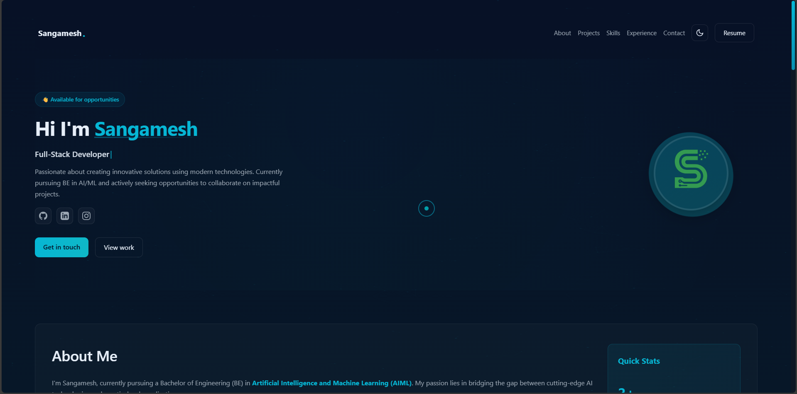
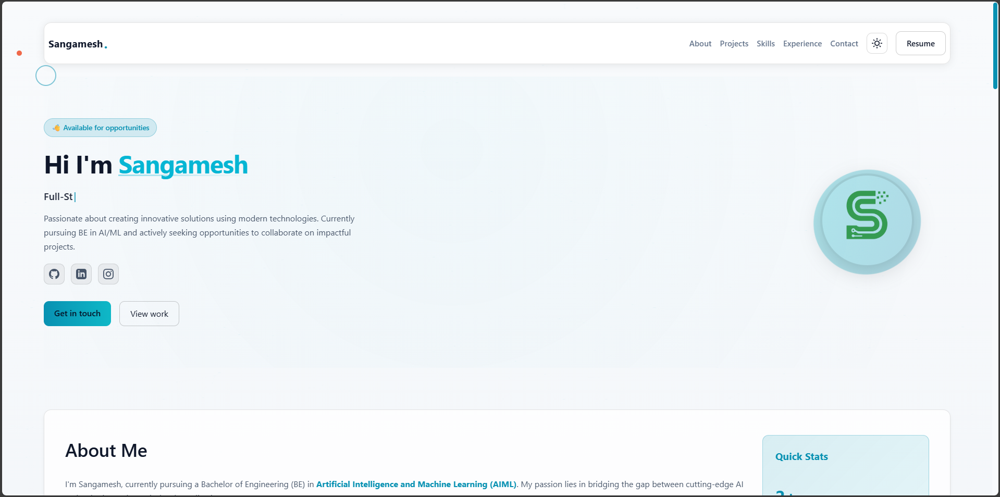

# Portfolio - Professional Web Developer Showcase

<div align="center">


</div>

A premium, feature-rich portfolio website designed for modern web developers and engineers. This portfolio showcases advanced front-end capabilities including dual theme support, interactive animations, dynamic content filtering, and responsive design across all devices.

## 📚 Table of Contents

- [🎯 Overview](#-overview)
- [✨ Features](#-features)
  - [Core Capabilities](#core-capabilities)
  - [User Experience Enhancements](#user-experience-enhancements)
- [🚀 Technology Stack](#-technology-stack)
  - [Core Technologies](#core-technologies)
  - [External Libraries](#external-libraries)
  - [Performance Optimizations](#performance-optimizations)
- [📱 Responsive Design Architecture](#-responsive-design-architecture)
- [🎨 Design System](#-design-system)
- [📝 Customization Guide](#-customization-guide)
- [📦 Project Structure](#-project-structure)
- [🌐 Deployment](#-deployment)
- [🌍 Browser Support](#-browser-support)
- [♿ Accessibility Features](#-accessibility-features)
- [🔧 Troubleshooting](#-troubleshooting)
- [📈 Performance Metrics](#-performance-metrics)
- [📚 Additional Resources](#-additional-resources)
- [📝 License & Credits](#-license--credits)

## 🎯 Overview

This portfolio represents a comprehensive solution for developers seeking to establish a professional online presence. Built with vanilla JavaScript and modern CSS, it demonstrates technical proficiency while maintaining optimal performance and accessibility standards.

### Key Differentiators

✅ **Dual-Theme System** - Dark and light modes with localStorage persistence  
✅ **Advanced Animations** - Scroll-triggered reveals, parallax, and micro-interactions  
✅ **Interactive Timeline** - Professional experience visualization  
✅ **Client Testimonials** - Social proof with elegant card layouts  
✅ **Dynamic Filtering** - Project categorization with smooth transitions  
✅ **Custom Cursor** - Premium desktop experience (auto-disabled on mobile)  
✅ **Performance Optimized** - Lazy loading, GPU acceleration, minimal bundle size  
✅ **Accessibility First** - WCAG 2.1 AA compliant, keyboard navigable  
✅ **SEO Ready** - Semantic HTML, meta tags, Open Graph protocol  
✅ **Zero Dependencies*** - Vanilla JS with optional lightweight libraries

### Quick Stats

| Metric | Value |
|--------|-------|
| Total Size (uncompressed) | ~80KB (excluding images) |
| Load Time | < 1.5s (on 3G) |
| Lighthouse Performance | 95+ |
| Accessibility Score | 100 |
| Browser Support | Modern browsers (2020+) |
| Sections | 7 main sections |
| Themes | 2 (Dark/Light) |
| Responsive Breakpoints | 5 |

### Live Demo

👉 [View Live Demo](https://your-portfolio-url.com) (Replace with your URL after deployment)

### Screenshots

<div align="center">

| Dark Theme | Light Theme |
|------------|-------------|
|  |  |

</div>

## ✨ Features

### Core Capabilities

#### 1. Dual Theme System
- **Dark Theme** - Sophisticated dark color palette with cyan accents (`#06b6d4`)
- **Light Theme** - Clean, professional light mode with optimized contrast
- **Theme Toggle** - Animated sun/moon icon in navigation bar
- **Persistence** - User preference saved via localStorage
- **Smooth Transitions** - Seamless color interpolation between themes
- **Complete Coverage** - All components fully styled for both themes

#### 2. Hero Section with Dynamic Typing
- **Typed.js Integration** - Professional typing animation showcasing multiple roles
- **Configurable Roles** - Easily customizable role array in script.js
- **Responsive Typography** - Fluid font sizing across all breakpoints
- **Social Integration** - Direct links to GitHub, LinkedIn, and other platforms
- **Animated Avatar** - Gradient border rotation with hover effects
- **Parallax Effect** - Depth-based scrolling on desktop devices
- **CTA Buttons** - Dual call-to-action with download and contact options

#### 3. Interactive Experience Timeline
- **Vertical Timeline Layout** - Professional chronological visualization
- **Animated Markers** - Hover-responsive timeline dots with pulse effects
- **Education & Work History** - Comprehensive career progression display
- **Scroll Reveal** - Staggered fade-in animation on viewport entry
- **Responsive Design** - Adapts to single-column on mobile devices
- **Flexible Structure** - Easy addition of new timeline entries

#### 4. Client Testimonials Section
- **Card-Based Layout** - Professional testimonial cards with gradient avatars
- **Avatar Initials** - Automatic generation from client names
- **Hover Interactions** - Subtle lift and shadow effects
- **Quote Styling** - Decorative quotation marks for emphasis
- **Author Metadata** - Name, role, and company information
- **Responsive Grid** - Multi-column layout adjusts to screen size

#### 5. Dynamic Project Filtering
- **Category System** - Filter projects by type (All, AI/ML, Web Apps, Backend, Tools)
- **Smooth Animations** - Fade-in/fade-out transitions during filtering
- **Active State Management** - Visual indication of selected filter
- **Data Attributes** - Tag-based filtering using HTML5 data attributes
- **Extensible** - Easy addition of new categories and projects
- **Stagger Animation** - Sequential reveal of filtered projects

#### 6. Custom Cursor (Desktop)
- **Dual-Layer System** - Inner dot with outer following circle
- **Hover States** - Scale transformation on interactive elements
- **Blend Modes** - CSS mix-blend-mode for universal compatibility
- **Touch Detection** - Automatically disabled on mobile/tablet devices
- **Smooth Following** - Delayed tracking for premium feel
- **Performance Optimized** - RequestAnimationFrame for 60fps

#### 7. About Section
- **Professional Biography** - Comprehensive introduction and background
- **Contact Information** - Email, phone, location with iconography
- **Info Cards** - Stats and quick facts in organized layout
- **Two-Column Grid** - Desktop layout for optimal information density
- **Responsive Stacking** - Mobile-friendly single column

#### 8. Skills Showcase
- **Categorized Display** - Organized by Frontend, Backend, AI/ML, and Tools
- **Interactive Badges** - Hover effects with color transitions
- **Comprehensive Stack** - Full technology portfolio display
- **Visual Hierarchy** - Clear separation between skill categories

#### 9. Projects Gallery
- **Grid Layout** - Responsive multi-column project cards
- **Rich Metadata** - Project descriptions, tech stack, and links
- **Image Optimization** - Lazy loading for performance
- **Hover Effects** - Card elevation and shadow enhancement
- **Technology Badges** - Visual stack indicators
- **Dual CTA** - Live demo and source code links

#### 10. Contact Form
- **Client-Side Validation** - Real-time input validation
- **Loading States** - Visual feedback during submission
- **Success/Error Messages** - User-friendly response handling
- **Responsive Layout** - Two-column grid on desktop
- **Email Integration** - Configurable mailto or API endpoint

### User Experience Enhancements

- **Loading Screen** - Professional entrance animation with branding
- **Smooth Scrolling** - Eased navigation with offset compensation
- **Scroll-to-Top** - Floating button with fade-in trigger
- **Mobile Navigation** - Hamburger menu with slide animation
- **Intersection Observer** - Scroll-triggered section reveals
- **Active Nav Highlighting** - Dynamic indication of current section
- **Parallax Effects** - Subtle depth on desktop (disabled mobile)
- **Micro-Interactions** - Button hovers, card lifts, badge transitions
- **Form Feedback** - Visual states for all user inputs
- **Prefers-Reduced-Motion** - Respects user accessibility preferences

## 🚀 Technology Stack

### Core Technologies

**HTML5**
- Semantic markup structure (`<header>`, `<nav>`, `<main>`, `<section>`, `<article>`)
- Accessibility-focused ARIA labels and roles
- SEO-optimized meta tags and Open Graph protocol
- Structured data with proper heading hierarchy

**CSS3**
- CSS Custom Properties (variables) for theming
- CSS Grid and Flexbox for responsive layouts
- CSS Animations and Transitions (keyframes, transforms)
- Advanced selectors and pseudo-elements
- Media queries with mobile-first approach
- CSS filters and blend modes
- Hardware-accelerated transforms (GPU optimization)

**JavaScript (ES6+)**
- Vanilla JavaScript (no framework dependencies)
- Modern ES6+ features (arrow functions, destructuring, template literals)
- DOM manipulation and event handling
- Intersection Observer API for scroll animations
- LocalStorage API for theme persistence
- Canvas API for particle system
- RequestAnimationFrame for smooth animations

### External Libraries

**Typed.js**
- Dynamic typing animation in hero section
- Configurable speed and behavior
- Lightweight (~5KB)

**ScrollReveal**
- Scroll-triggered animation library
- Declarative animation configuration
- Performance-optimized viewport detection

**Lucide Icons**
- Modern, consistent icon system
- Lightweight SVG icons
- Extensive icon library

### Performance Optimizations

- **Lazy Loading** - Images load on-demand as they enter viewport
- **Debounced Events** - Scroll and resize listeners optimized
- **CSS Transform Optimization** - GPU-accelerated animations
- **Minimal Repaints** - Batched DOM reads/writes
- **Efficient Selectors** - Cached DOM queries
- **RequestAnimationFrame** - Browser-optimized animation timing
- **Asset Optimization** - Minifiable structure for production

## 📱 Responsive Design Architecture

### Breakpoint Strategy

**Mobile First Approach**
- Base styles optimized for mobile devices (320px+)
- Progressive enhancement for larger screens
- Fluid typography with viewport units

**Breakpoints:**

| Device | Width | Layout Adjustments |
|--------|-------|-------------------|
| Mobile (Portrait) | < 480px | Single column, stacked navigation, simplified timeline |
| Mobile (Landscape) / Small Tablet | 480px - 768px | Two-column grids, expanded navigation |
| Tablet / Small Desktop | 768px - 1024px | Multi-column project grid, desktop navigation |
| Desktop | 1024px - 1440px | Full feature set, custom cursor, parallax enabled |
| Large Desktop / 4K | > 1440px | Maximum width constraints, optimized spacing |

### Responsive Features

**Mobile Optimizations:**
- Hamburger navigation menu with slide animation
- Touch-optimized button sizes (minimum 44x44px)
- Disabled parallax and custom cursor
- Simplified timeline layout
- Single-column card layouts
- Optimized font sizes and spacing
- Reduced animation complexity

**Desktop Enhancements:**
- Multi-column project grid (3 columns)
- Custom animated cursor
- Parallax scrolling effects
- Enhanced hover states
- Expanded navigation bar
- Larger typography and spacing

**Cross-Device:**
- Flexible images with max-width: 100%
- Viewport-relative units (vw, vh, rem)
- CSS Grid and Flexbox for fluid layouts
- Touch and mouse event handling

## 🎨 Design System

### Color Palette

**Dark Theme (Default)**
```css
--bg-primary: #0a0e1a;           /* Primary background */
--bg-secondary: #0f1419;         /* Secondary background */
--accent: #06b6d4;               /* Cyan accent */
--accent-hover: #0891b2;         /* Hover state */
--text-primary: #e6eef8;         /* Primary text */
--text-secondary: #9aa6b2;       /* Secondary text */
--border: rgba(255,255,255,0.1); /* Borders and dividers */
```

**Light Theme**
```css
--bg-primary: #ffffff;           /* Primary background */
--bg-secondary: #f5f7fa;         /* Secondary background */
--accent: #0891b2;               /* Adjusted cyan */
--accent-hover: #06b6d4;         /* Hover state */
--text-primary: #1a1a1a;         /* Primary text */
--text-secondary: #4a5568;       /* Secondary text */
--border: rgba(0,0,0,0.1);       /* Borders and dividers */
```

### Typography

**Font Stack:**
```css
font-family: 'Inter', -apple-system, BlinkMacSystemFont, 'Segoe UI', sans-serif;
```

**Scale:**
- Hero Title: `clamp(2rem, 5vw, 3.5rem)`
- Section Headings: `clamp(1.75rem, 4vw, 2.5rem)`
- Subsection Headings: `clamp(1.25rem, 3vw, 1.75rem)`
- Body Text: `clamp(0.95rem, 2vw, 1.1rem)`
- Small Text: `0.875rem`

### Spacing System

Consistent spacing using 8px base unit:
```css
--space-xs: 0.5rem;   /* 8px */
--space-sm: 1rem;     /* 16px */
--space-md: 1.5rem;   /* 24px */
--space-lg: 2rem;     /* 32px */
--space-xl: 3rem;     /* 48px */
--space-2xl: 4rem;    /* 64px */
```

## 📝 Customization Guide

### Quick Start Customization

#### 1. Personal Information

**Update in `index.html`:**

```html
<!-- Hero Section -->
<h1>Hi I'm <span class="name-highlight">Your Name</span></h1>

<!-- Typing animation roles in script.js -->
const roles = [
  'Full-Stack Developer',
  'Your Role',
  'Your Specialization'
];

<!-- About Section -->
<li><span class="icon">✉</span> <strong>Email:</strong> <a href="mailto:your@email.com">your@email.com</a></li>
<li><span class="icon">📞</span> <strong>Phone:</strong> +1 (XXX) XXX-XXXX</li>
<li><span class="icon">📍</span> <strong>Location:</strong> Your City, Country</li>
```

#### 2. Social Media Links

```html
<!-- Update all social links -->
<a href="https://github.com/yourusername" target="_blank" aria-label="GitHub">
<a href="https://linkedin.com/in/yourprofile" target="_blank" aria-label="LinkedIn">
<a href="https://twitter.com/yourhandle" target="_blank" aria-label="Twitter">
```

#### 3. Projects Configuration

**Add/Edit Projects:**

```html
<article class="project" data-category="web-app">
  
  <div class="project-content">
    <h3>Project Name</h3>
    <p>Brief description of what the project does and technologies used.</p>
    
    <!-- Technology Badges -->
    <div class="tech-badges">
      <span class="badge">React</span>
      <span class="badge">Node.js</span>
      <span class="badge">MongoDB</span>
    </div>
    
    <!-- Action Buttons -->
    <div class="project-links">
      <a href="https://demo-url.com" class="btn-primary" target="_blank">Live Demo</a>
      <a href="https://github.com/user/repo" class="btn-secondary" target="_blank">Source Code</a>
    </div>
  </div>
</article>
```

**Add Project Categories:**

```html
<!-- Add filter button in Projects section -->
<button class="filter-btn" data-filter="your-category">Your Category</button>

<!-- Tag project with category -->
<article class="project" data-category="your-category">
```

#### 4. Experience Timeline

```html
<div class="timeline-item">
  <div class="timeline-dot"></div>
  <div class="timeline-content">
    <div class="timeline-date">2023 - Present</div>
    <h3 class="timeline-title">Senior Developer</h3>
    <p class="timeline-subtitle">Company Name</p>
    <p class="timeline-description">
      Responsibilities and achievements in this role.
    </p>
  </div>
</div>
```

#### 5. Testimonials

```html
<div class="testimonial-card">
  <div class="quote-icon">“</div>
  <p class="testimonial-text">
    Client feedback or recommendation text goes here.
  </p>
  <div class="testimonial-author">
    <div class="author-avatar">JD</div>
    <div>
      <div class="author-name">John Doe</div>
      <div class="author-role">CEO, Company Name</div>
    </div>
  </div>
</div>
```

#### 6. Skills Configuration

```html
<!-- Update skills in each category -->
<div class="skill-category">
  <h3>Frontend</h3>
  <div class="skill-tags">
    <span class="skill-tag">React</span>
    <span class="skill-tag">Vue.js</span>
    <span class="skill-tag">Your Skill</span>
  </div>
</div>
```

#### 7. Theme Customization

**Modify in `style.css`:**

```css
/* Change accent color */
:root {
  --accent: #your-color;          /* Primary accent */
  --accent-hover: #your-color;    /* Hover state */
}

/* Adjust dark theme colors */
[data-theme="dark"] {
  --bg-primary: #your-bg-color;
  --text-primary: #your-text-color;
}

/* Adjust light theme colors */
[data-theme="light"] {
  --bg-primary: #your-bg-color;
  --text-primary: #your-text-color;
}
```

#### 8. Typing Animation Configuration

**Modify in `script.js`:**

```javascript
// Update roles array
const roles = [
  'Your Primary Role',
  'Your Secondary Role',
  'Your Skill/Title',
  'Another Descriptor'
];

// Adjust typing speed (optional)
const typed = new Typed('#typed', {
  strings: roles,
  typeSpeed: 50,      // Typing speed in ms
  backSpeed: 30,      // Backspacing speed
  backDelay: 2000,    // Delay before backspacing
  loop: true
});
```

#### 9. Contact Form Backend Integration

**Option A: FormSpree**

```javascript
// In script.js, replace form handler
const form = document.querySelector('#contact-form');
form.action = 'https://formspree.io/f/your-form-id';
form.method = 'POST';
```

**Option B: EmailJS**

```javascript
emailjs.init('your-public-key');

form.addEventListener('submit', function(e) {
  e.preventDefault();
  emailjs.sendForm('your-service-id', 'your-template-id', this)
    .then(() => console.log('Success!'));
});
```

#### 10. Assets Update

**Profile Image:**
```html
<!-- Place image in /images folder -->

```

**Resume File:**
```html
<!-- Add resume.pdf to root folder -->
<a href="resume.pdf" download class="btn-primary">Download Resume</a>
```

**Project Images:**
- Recommended size: 800x600px or 1200x900px
- Format: JPG or WebP for best performance
- Optimize images before uploading (use TinyPNG or similar)

### Advanced Customization

#### Disable Features

**Disable Custom Cursor:**
```javascript
// In script.js, comment out cursor initialization
// initCustomCursor();
```

**Disable Parallax:**
```javascript
// In script.js, comment out parallax initialization
// initParallax();
```

**Disable Typing Animation:**
```javascript
// In script.js, comment out Typed.js initialization
// const typed = new Typed(...);
```

#### Add New Sections

```html
<!-- Add to index.html -->
<section id="new-section" class="section">
  <div class="container">
    <h2 class="section-title">Section Title</h2>
    <!-- Your content -->
  </div>
</section>

<!-- Add to navigation -->
<a href="#new-section" class="nav-link">Section Name</a>
```

#### Modify Animations

```javascript
// In script.js, adjust ScrollReveal settings
ScrollReveal().reveal('.element', {
  duration: 1000,    // Animation duration
  distance: '50px',  // Movement distance
  origin: 'bottom',  // Animation origin
  delay: 200,        // Delay before animation
  easing: 'ease'     // Easing function
});
```

## 📦 Project Structure

```
portfolio/
├── index.html              # Main HTML structure
├── style.css               # Complete stylesheet with themes
├── script.js               # JavaScript functionality
├── README.md               # Project documentation
├── QUICK_START.md          # Quick setup guide
├── TROUBLESHOOTING.md      # Common issues and solutions
├── UPGRADES.md             # Feature upgrade documentation
├── images/
│   ├── profile.png         # Profile/avatar image
│   ├── project1.jpg        # Project screenshots
│   ├── project2.jpg
│   └── project3.jpg
├── assets/
│   └── resume.pdf          # Resume file for download
└── libs/                   # External libraries (optional CDN)
    ├── typed.min.js
    ├── scrollreveal.min.js
    └── lucide.min.js
```

### File Descriptions

| File | Purpose | Size (approx) |
|------|---------|---------------|
| `index.html` | Main structure, content, and semantic markup | ~15KB |
| `style.css` | Complete styling, themes, animations, responsive | ~25KB |
| `script.js` | All interactivity, animations, form handling | ~10KB |
| External libs | Typed.js, ScrollReveal, Lucide Icons | ~30KB total |

**Total Size:** ~80KB (excluding images)

## 🌐 Deployment

### Hosting Platforms

#### GitHub Pages (Free)

```bash
# 1. Initialize git repository
git init
git add .
git commit -m "Initial portfolio commit"

# 2. Create GitHub repository and push
git remote add origin https://github.com/username/portfolio.git
git branch -M main
git push -u origin main

# 3. Enable GitHub Pages
# Settings > Pages > Source: main branch
# Your site will be at: https://username.github.io/portfolio
```

#### Netlify (Free)

**Option 1: Drag & Drop**
1. Visit [netlify.com](https://netlify.com)
2. Drag your project folder to the upload area
3. Site is live instantly with auto-generated URL

**Option 2: Git Integration**
```bash
# Install Netlify CLI
npm install -g netlify-cli

# Deploy
netlify deploy --prod
```

**netlify.toml** (optional):
```toml
[build]
  publish = "."
  
[[redirects]]
  from = "/*"
  to = "/index.html"
  status = 200
```

#### Vercel (Free)

```bash
# Install Vercel CLI
npm install -g vercel

# Deploy
vercel

# Follow prompts, site deployed instantly
```

**vercel.json** (optional):
```json
{
  "cleanUrls": true,
  "trailingSlash": false
}
```

#### Cloudflare Pages (Free)

1. Push code to GitHub
2. Connect repository at [pages.cloudflare.com](https://pages.cloudflare.com)
3. Configure build settings (none needed for static site)
4. Deploy automatically on each push

#### Traditional Hosting

For cPanel, FTP, or shared hosting:
1. Zip all files
2. Upload to server's public_html or www folder
3. Extract files
4. Access via your domain

### Pre-Deployment Checklist

- [ ] Update all personal information
- [ ] Replace placeholder images with actual screenshots
- [ ] Test all external links (social media, projects)
- [ ] Add actual resume.pdf file
- [ ] Configure contact form backend (FormSpree/EmailJS)
- [ ] Test on multiple devices and browsers
- [ ] Validate HTML ([validator.w3.org](https://validator.w3.org))
- [ ] Validate CSS ([jigsaw.w3.org/css-validator](https://jigsaw.w3.org/css-validator/))
- [ ] Check accessibility ([wave.webaim.org](https://wave.webaim.org))
- [ ] Test page speed ([PageSpeed Insights](https://pagespeed.web.dev/))
- [ ] Ensure all images are optimized
- [ ] Test both dark and light themes
- [ ] Verify mobile responsiveness
- [ ] Set up custom domain (optional)

### Performance Optimization for Production

**Image Optimization:**
```bash
# Use ImageOptim, TinyPNG, or similar
# Convert to WebP format for better compression
```

**Minification:**
```bash
# Minify CSS
npx clean-css-cli style.css -o style.min.css

# Minify JavaScript
npx terser script.js -o script.min.js

# Update references in index.html
```

**CDN for Libraries:**
```html
<!-- Use CDN links for faster global loading -->
<script src="https://cdn.jsdelivr.net/npm/typed.js@2.0.16"></script>
<script src="https://unpkg.com/scrollreveal@4.0.9/dist/scrollreveal.min.js"></script>
```

## 🌍 Browser Support

### Fully Supported

| Browser | Minimum Version | Notes |
|---------|----------------|-------|
| Chrome | 90+ | Full support, optimal performance |
| Firefox | 88+ | Full support |
| Safari | 14+ | Full support, includes iOS Safari |
| Edge | 90+ | Full support (Chromium-based) |
| Opera | 76+ | Full support |

### Not Supported

- Internet Explorer 11 and below (uses modern CSS features)
- Android Browser < 2020 versions
- Opera Mini (limited CSS support)

### Feature Degradation

**Modern browsers (recommended):**
- Full feature set including custom cursor, parallax, advanced animations

**Older supported browsers:**
- Custom cursor disabled
- Simplified animations
- Basic theme switching
- All content remains accessible

## ♿ Accessibility Features

### WCAG 2.1 Compliance

**Level AA Standards:**
- ✅ Color contrast ratios meet minimum requirements (4.5:1 for text)
- ✅ Keyboard navigation for all interactive elements
- ✅ Focus indicators on all focusable elements
- ✅ Semantic HTML structure
- ✅ ARIA labels for icon-only buttons
- ✅ Alt text for all images
- ✅ Proper heading hierarchy (H1-H6)
- ✅ Skip navigation links (optional, can be added)

### Screen Reader Support

- Tested with NVDA and VoiceOver
- Semantic landmarks (`<nav>`, `<main>`, `<section>`)
- ARIA roles where appropriate
- Descriptive link text
- Form labels properly associated

### Reduced Motion Support

```css
/* Respects user's motion preferences */
@media (prefers-reduced-motion: reduce) {
  * {
    animation-duration: 0.01ms !important;
    transition-duration: 0.01ms !important;
  }
}
```

### Keyboard Navigation

- Tab through all interactive elements
- Enter/Space to activate buttons and links
- Escape to close mobile menu
- Arrow keys for navigation (where applicable)

## 🔧 Troubleshooting

### Common Issues

**Animations not working:**
- Ensure JavaScript is enabled
- Check browser console for errors
- Verify library CDN links are accessible

**Theme toggle not persisting:**
- Check if localStorage is enabled
- Clear browser cache and cookies
- Try incognito/private mode

**Images not loading:**
- Verify file paths are correct
- Check image file extensions match HTML
- Ensure images are in correct folder

**Contact form not working:**
- Configure backend service (FormSpree/EmailJS)
- Check email configuration in script.js
- Verify form action attribute

**Custom cursor not appearing:**
- Check if using desktop device (disabled on mobile)
- Verify JavaScript is enabled
- Check browser console for errors

### Debug Mode

```javascript
// Add to script.js for debugging
console.log('Portfolio initialized');

// Check if libraries loaded
console.log('Typed:', typeof Typed);
console.log('ScrollReveal:', typeof ScrollReveal);
```

## 📈 Performance Metrics

### Lighthouse Scores (Target)

- **Performance:** 95+
- **Accessibility:** 100
- **Best Practices:** 95+
- **SEO:** 100

### Load Time Benchmarks

- **First Contentful Paint:** < 1.5s
- **Time to Interactive:** < 3.0s
- **Total Blocking Time:** < 300ms
- **Cumulative Layout Shift:** < 0.1

### Optimization Tips

1. Use WebP images for better compression
2. Enable gzip compression on server
3. Use CDN for external libraries
4. Minify CSS and JavaScript for production
5. Implement lazy loading for images
6. Use font-display: swap for web fonts

## 📚 Additional Resources

### Documentation

- **QUICK_START.md** - Fast setup instructions
- **TROUBLESHOOTING.md** - Detailed problem-solving guide
- **UPGRADES.md** - Feature overview and upgrade notes

### External Libraries Documentation

- [Typed.js](https://github.com/mattboldt/typed.js/) - Typing animation
- [ScrollReveal](https://scrollrevealjs.org/) - Scroll animations
- [Lucide Icons](https://lucide.dev/) - Icon library

### Learning Resources

- [MDN Web Docs](https://developer.mozilla.org/) - Web development reference
- [CSS-Tricks](https://css-tricks.com/) - CSS techniques and tutorials
- [Web.dev](https://web.dev/) - Performance and best practices

## 📝 License & Credits

### License

**MIT License**

Copyright (c) 2025 Portfolio Template

Permission is hereby granted, free of charge, to any person obtaining a copy of this software and associated documentation files (the "Software"), to deal in the Software without restriction, including without limitation the rights to use, copy, modify, merge, publish, distribute, sublicense, and/or sell copies of the Software, and to permit persons to whom the Software is furnished to do so, subject to the following conditions:

The above copyright notice and this permission notice shall be included in all copies or substantial portions of the Software.

THE SOFTWARE IS PROVIDED "AS IS", WITHOUT WARRANTY OF ANY KIND, EXPRESS OR IMPLIED, INCLUDING BUT NOT LIMITED TO THE WARRANTIES OF MERCHANTABILITY, FITNESS FOR A PARTICULAR PURPOSE AND NONINFRINGEMENT. IN NO EVENT SHALL THE AUTHORS OR COPYRIGHT HOLDERS BE LIABLE FOR ANY CLAIM, DAMAGES OR OTHER LIABILITY, WHETHER IN AN ACTION OF CONTRACT, TORT OR OTHERWISE, ARISING FROM, OUT OF OR IN CONNECTION WITH THE SOFTWARE OR THE USE OR OTHER DEALINGS IN THE SOFTWARE.

### Credits

**Design & Development:** Sangamesh  
**Version:** 2.0  
**Last Updated:** January 2025

**Built With:**
- HTML5, CSS3, JavaScript (ES6+)
- Typed.js by Matt Boldt
- ScrollReveal by Julian Lloyd
- Lucide Icons

**Inspiration:**
- Modern web design trends
- Portfolio best practices
- Developer community feedback

### Contributing

Contributions, issues, and feature requests are welcome! Feel free to fork this project and submit pull requests.

### Support

If you found this portfolio template helpful:
- ⭐ Star the repository
- 👁️ Share with others
- 💬 Provide feedback
- ☕ Buy me a coffee (optional)

### Acknowledgments

Thanks to all developers who have contributed to the open-source libraries used in this project.

---

<div align="center">

**Made with ❤️ by developers, for developers**

[Report Bug](https://github.com/username/portfolio/issues) · [Request Feature](https://github.com/username/portfolio/issues)

</div>
